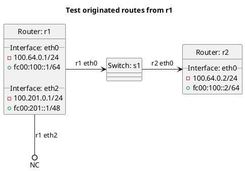

# BGP redistribution of originated routes

In the case of `test_redistribute_originated`: **(default)**
  - r1 should not be exporting its originated routes to r2 as this is default behavior.

In the case of `test_redistribute_originated_true`:
  - r1 should be exporting its originated routes to r2.

In the case of `test_redistribute_originated_false`:
  - r1 should not be exporting its originated routes to r2 as `redistribute:originated` is set to false.

In the case of `test_redistribute_originated_default`: **(default)**
  - r1 should not be exporting its originated default routes to r2 as this is default behavior.

In the case of `test_redistribute_originated_default_true`:
  - r1 should be exporting its originated default routes to r2 depending on the test case.

In the case of `test_redistribute_originated_default_false`:
  - r1 should not be exporting its originated default routes to r2 as `redistribute:originated_default` is set to false.

