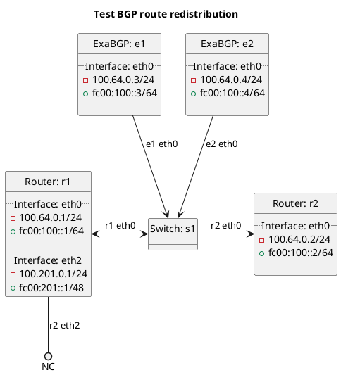

# Tests for redistribution of BGP routes

These tests test BGP route redistribution from e1/e2 via r1 to r2.

In terms of test set `t10_bgp`:
  - This test set tests redistribution of BGP routes (covering all routes of all types).

In terms of test set `t12_bgp_own`:
  - This test set tests redistribution of our own BGP routes (originating within our federation).

In terms of test set `t14_bgp_customer`:
  - This test set tests redistribution of BGP routes received from customers.

In terms of test set `t16_bgp_peering`:
  - This test set tests redistribution of BGP routes received from peers.

In terms of test set `t18_bgp_transit`:
  - This test set tests redistribution of BGP routes received from transit providers.

In terms of test set `t20_own_blackhole`:
  - This test set tests redistribution of our own BGP blackhole routes (originating within our federation).

In terms of test set `t22_bgp_customer_blackhole`:
  - This test set tests redistribution of BGP blackhole routes received from customers.

In terms of test set `t24_bgp_own_default`:
  - This test set tests redistribution of our own BGP default routes (originating within our federation).

In terms of test set `t26_bgp_transit_default`:
  - This test set tests redistribution of BGP default routes received from transit providers.

## Diagram

