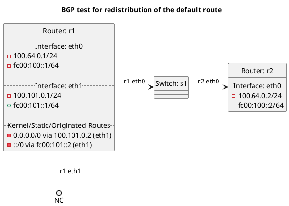

# BGP test for redistribution of the default route

Tests below may vary slightly depending on peer type.

**Tests for accepting peer default routes into BGP:**

In terms of test "test_accept_default_false":  (PEER:accept:default set to False)
  - Router r1 should export the kernel default route to r2, but r2 should not accept it into the BGP table.

In terms of test "test_accept_default_true":  (PEER:accept:default set to True)
  - Router r1 should export the kernel default route to r2, r2 should accept the default route into the BGP table.

In terms of test "test_accept_default":  (default configuration)
  - Router r1 should export the kernel default route to r2, but r2 should not accept it into the BGP table as it does not accept PEER default routes by default.
  - Except in the case of where peer_type is `rrserver-rrserver` which defaults to True.

**Tests for accepting peer default routes into our master table:**

In terms of test "test_bgp_accept_default_false":  (accept:default set to False)
  - Router r1 should export the kernel default route to r2, but r2 should not accept it into the master table.

In terms of test "test_bgp_accept_default_true":  (accept:default set to True)
  - Router r1 should export the kernel default route to r2, r2 should accept the default route into the master table.

In terms of test "test_bgp_accept_default":  (default configuration)
  - Router r1 should export the kernel default route to r2, but r2 should not accept it into the master table.

**Tests for redistributing default routes to a BGP peer:**

In terms of test "test_redistribute_default_false":  (PEER:redistribute:default set to False)
  - Router r1 should not export the kernel default route to r2.

In terms of test "test_redistribute_default_true":  (PEER:redistribute:default set to True)
  - Router r1 should export the kernel default route to r2.

In terms of test "test_redistribute_default":  (default configuration)
  - Router r1 should not export the kernel default route to r2.
  - Except in the case of where peer_type is `rrserver-rrserver` which defaults to True.

