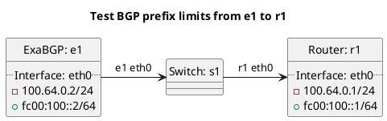

# BGP prefix limit tests

In terms of test `t10_user_defined`:
  - Exabgp e1 should be sending too many prefixes to r1 causing the session to be torn down.
  - The configuration for prefix limits is specified statically by the user.

In terms of test `t20_peeringdb`:
  - Exabgp e1 should be sending too many prefixes to r1 causing the session to be torn down.
  - The configuration for prefix limits is automatically pulled from PeeringDB.

In terms of test `t22_peeringdb_changes`:
  - Tests exceptions raised during substantial prefix limit changes.

In terms of test `t24_peeringdb_changes_ignore`:
  - Tests ignoring of exceptions raised during substantial prefix limit changes.

## Diagram

