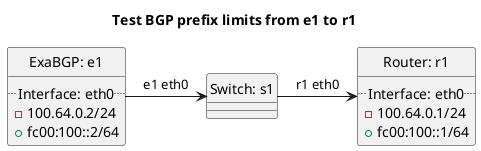

# BGP AS-SET change tests

In terms of test `t10_as_sets_changes`:
  - Test exceptions raised during substantial AS-SET prefix filter changes.

In terms of test `t12_as_sets_changes_ignore`:
  - Test ignoring exceptions raised during substantial AS-SET prefix filter changes.

In terms of test `t14_as_sets_use_cached`:
  - Test using previous cached AS-SET data when generating peer configuration.

## Diagram

