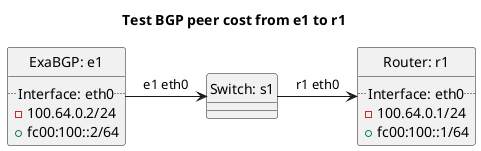

# BGP peer cost tests

Router r1 should be receiving routes from e1 test cases with a local pref -5 (cost = 5).

```plantuml
@startuml
hide circle
title Test BGP peer cost from e1 to r1


class "Router: r1" {
  .. Interface: eth0 ..
- 100.64.0.1/24
+ fc00:100::1/64
}


class "ExaBGP: e1" {
  .. Interface: eth0 ..
- 100.64.0.2/24
+ fc00:100::2/64
}


class "Switch: s1" {}

"ExaBGP: e1" -> "Switch: s1": e1 eth0
"Switch: s1" -> "Router: r1": r1 eth0

@enduml
```
