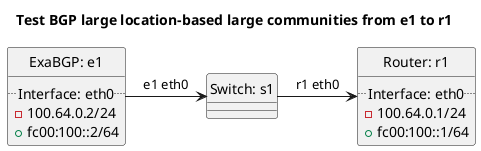

# BGP location-based large community tests

Router r1 should be receiving routes from e1 test cases.

**Tests for BGP location-based large communities:**

In terms of test "test_bgp_stripping_community_location_iso3166":
  - ExaBGP e1 should export a prefix to router to r2, router r2 should add a location-based ISO-3166 large community.

In terms of test "test_bgp_stripping_community_location_unm49":
  - ExaBGP e1 should export a prefix to router to r2, router r2 should add a location-based UN.M49 large community.

