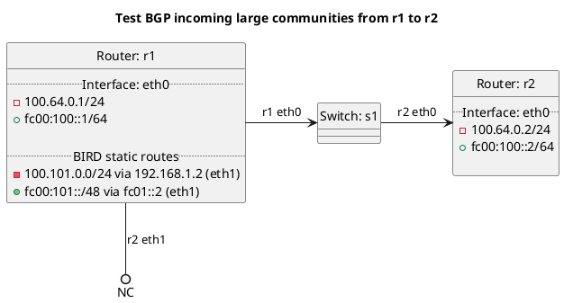

# BGP incoming large community tests

Router r1 should be advertising a prefix to router r2.

In terms of test "test_incoming_large_communities":
  - Router r1 should be advertising a prefix to router to r2, router r2 should be adding a incoming large community to the prefix it receives.

## Diagram

