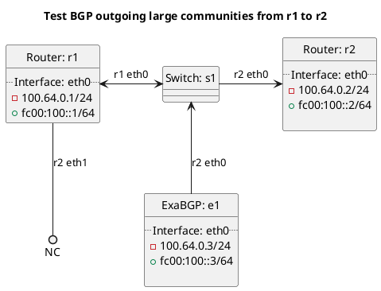

# BGP outgoing large community tests

Router r1 should be advertising a prefix to router r2.

## Tests for BGP outgoing large communities to BGP route types

For these tests r1 is peering with e1 which is advertising routes as a route reflector with various large communities set to seed the below tests with data.

In terms of test "test_bgp_outgoing_large_communities_bgp_customer":
  - ExaBGP e1 should advertise routes to r1 and r1 should add a large community the customer route to r2 with a large community added.

In terms of test "test_bgp_outgoing_large_communities_bgp":
  - ExaBGP e1 should advertise routes to r1 and r1 should add a large community all BGP routes to r2 with a large community added.

In terms of test "test_bgp_outgoing_large_communities_bgp_own":
  - ExaBGP e1 should advertise routes to r1 and r1 should add a large community OWN BGP routes to r2 with a large community added.

In terms of test "test_bgp_outgoing_large_communities_bgp_peering":
  - ExaBGP e1 should advertise routes to r1 and r1 should add a large community peering BGP routes to r2 with a large community added.

In terms of test "test_bgp_outgoing_large_communities_bgp_transit":
  - ExaBGP e1 should advertise routes to r1 and r1 should add a large community transit BGP routes to r2 with a large community added.

## Tests for BGP outgoing large communities to route types

In terms of test "test_bgp_outgoing_large_communities_connected":
  - r1 should add a large community connected routes to r2 with a large community added.

In terms of test "test_bgp_outgoing_large_communities_default":
  - r1 should add a large community the default route to r2 with a large community added.

In terms of test "test_bgp_outgoing_large_communities_kernel":
  - r1 should add a large community the kernel routes to r2 with a large community added.

In terms of test "test_bgp_outgoing_large_communities_originated":
  - r1 should add a large community originated routes to r2 with a large community added.

In terms of test "test_bgp_outgoing_large_communities_static":
  - r1 should add a large community static routes to r2 with a large community added.

## Diagram

