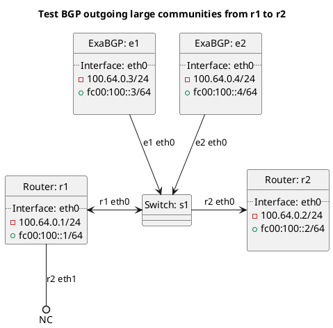

# BGP outgoing large community tests

ExaBGP e1 and e2 should be advertising various types of routes to r1, which should in turn be advertising to r2 based on the test case.

## Test sets for BGP outgoing large communities

In terms of test set "t10_connected":
  - This test set tests adding a large community to a connected route.

In terms of test set "t12_kernel":
  - This test set tests adding a large community to a kernel route.

In terms of test set "t14_static":
  - This test set tests adding a large community to a static route.

In terms of test set "t16_originated":
  - This test set tests adding a large community to an orginated route.

In terms of test set "t20_bgp":
  - This test set tests adding a large community to a route we received via BGP.

In terms of test set "t22_bgp_own":
  - This test set tests adding a large community to a route originating within our federation that we received via BGP.

In terms of test set "t24_bgp_customer":
  - This test set tests adding a large community to a route originating from a customer.

In terms of test set "t26_bgp_peering":
  - This test set tests adding a large community to a route originating from a peer.

In terms of test set "t28_bgp_transit":
  - This test set tests adding a large community to a route originating from a transit provider.

In terms of test set "t30_community_list":
  - This test set tests adding a large community all advertised routes.

## Diagram

