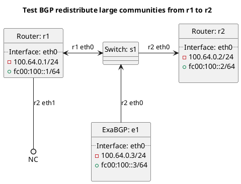

# BGP redistribute large community tests

Router r1 should be advertising a prefix to router r2.

## Tests for BGP internal redistribution of BGP route types

For these tests r1 is peering with e1 which is advertising routes as a route reflector with various large communities set to seed the below tests with data.

In terms of test "test_bgp_redistribute_bgp_customer_large_communities":
  - ExaBGP e1 should advertise routes to r1 and r1 should redistribute the customer route to r2 with a large community added.

In terms of test "test_bgp_redistribute_bgp_large_communities":
  - ExaBGP e1 should advertise routes to r1 and r1 should redistribute all BGP routes to r2 with a large community added.

In terms of test "test_bgp_redistribute_bgp_own_large_communities":
  - ExaBGP e1 should advertise routes to r1 and r1 should redistribute OWN BGP routes to r2 with a large community added.

In terms of test "test_bgp_redistribute_bgp_peering_large_communities":
  - ExaBGP e1 should advertise routes to r1 and r1 should redistribute peering BGP routes to r2 with a large community added.

In terms of test "test_bgp_redistribute_bgp_transit_large_communities":
  - ExaBGP e1 should advertise routes to r1 and r1 should redistribute transit BGP routes to r2 with a large community added.

## Tests for BGP redistribution of route types

In terms of test "test_bgp_redistribute_connected_large_communities":
  - r1 should redistribute connected routes to r2 with a large community added.

In terms of test "test_bgp_redistribute_default_large_communities":
  - r1 should redistribute the default route to r2 with a large community added.

In terms of test "test_bgp_redistribute_kernel_large_communities":
  - r1 should redistribute the kernel routes to r2 with a large community added.

In terms of test "test_bgp_redistribute_originated_large_communities":
  - r1 should redistribute originated routes to r2 with a large community added.

In terms of test "test_bgp_redistribute_static_large_communities":
  - r1 should redistribute static routes to r2 with a large community added.

## Diagram

