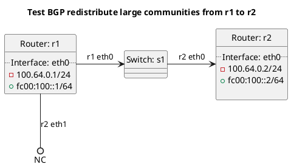

# BGP redistribute large community tests

Router r1 should be advertising a prefix to router r2.

**Tests for BGP redistribute large communities:**

In terms of test "test_outgoing_large_communities":
  - Router r1 should be advertising a prefix to router to r2, router r1 should be adding a redistribute large community to the prefix it advertises.

IMPORTANT - FIXME:
redistribute_bgp_large_community - peers with e1 as a route relfector

