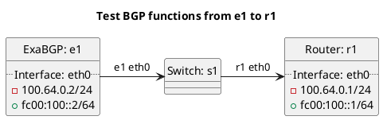

# BGP large community function tests (inbound)

Router r1 should be receiving routes from e1 test cases.

In terms of test "test_bgp_large_community_localpref_minus_1":
  - Router r1 should receive a route from e1 with the local pref adjustment large community and -1 from the local_pref.

In terms of test "test_bgp_large_community_localpref_minus_2":
  - Router r1 should receive a route from e1 with the local pref adjustment large community and -2 from the local_pref.

In terms of test "test_bgp_large_community_localpref_minus_3":
  - Router r1 should receive a route from e1 with the local pref adjustment large community and -3 from the local_pref.

## Diagram

