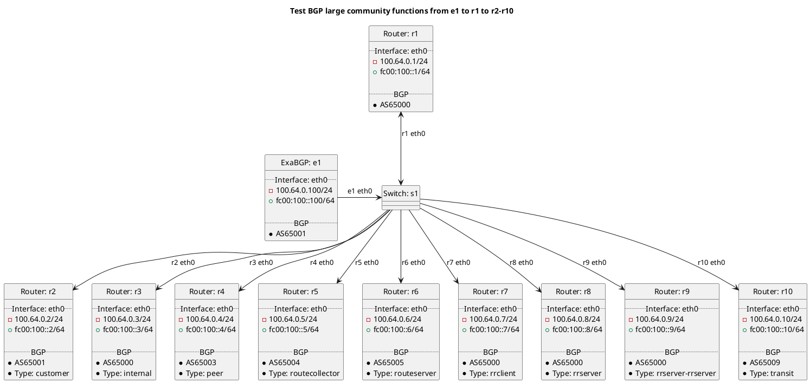

# BGP large community function tests (outbound)

Router r1 should be receiving routes from e1 test cases and advertising to r2-r9.

In terms of test set "t10_noexport_asn":
  - ExaBGP e1 should advertise a route with a large community to prevent exporting based on ASN to each peer type.

In terms of test set "t12_noexport_location":
  - ExaBGP e1 should advertise a route with a large community to prevent exporting based on location to each peer type.

In terms of test set "t20_noexport":
  - ExaBGP e1 should advertise a route with a large community to prevent exporting based on peer type to each peer type.

In terms of test set "t30_prepend_1x":
  - ExaBGP e1 should advertise a route with a large community that should result in prepending 1x.

In terms of test set "t30_prepend_1x_61":
  - ExaBGP e1 should advertise a route with a large community that should result in prepending 1x.

In terms of test set "t31_prepend_2x":
  - ExaBGP e1 should advertise a route with a large community that should result in prepending 2x.

In terms of test set "t32_prepend_3x":
  - ExaBGP e1 should advertise a route with a large community that should result in prepending 3x.

In terms of test set "t40_prepend_location_1x":
  - ExaBGP e1 should advertise a route with a large community that should result in prepending 1x to the specified location.

In terms of test set "t40_prepend_location_1x_71":
  - ExaBGP e1 should advertise a route with a large community that should result in prepending 1x to the specified location.

In terms of test set "t40_prepend_location_2x":
  - ExaBGP e1 should advertise a route with a large community that should result in prepending 2x to the specified location.

In terms of test set "t40_prepend_location_3x":
  - ExaBGP e1 should advertise a route with a large community that should result in prepending 3x to the specified location.

In terms of test set "t50_replace_aspath":
  - ExaBGP e1 should advertise a route that should result in the AS-PATH being replaced while advertising to eBGP peers.

## Diagram

