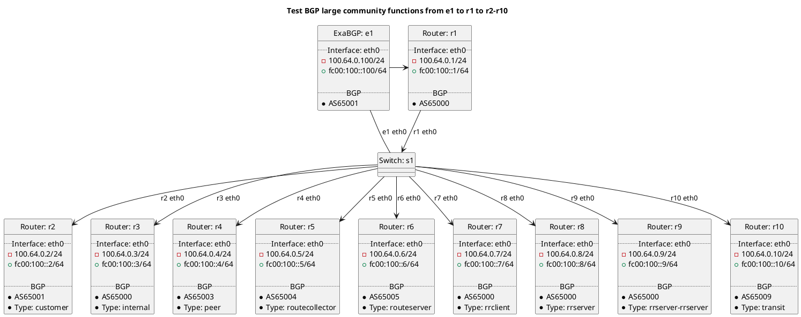

# BGP large community function tests (outbound)

Router r1 should be receiving routes from e1 test cases and advertising to r2-r9.

TODO

```plantuml
@startuml
hide circle
title Test BGP large community functions from e1 to r1 to r2-r10


class "Router: r1" {
  .. Interface: eth0 ..
- 100.64.0.1/24
+ fc00:100::1/64

  .. BGP ..
* AS65000
}


class "Router: r2" {
  .. Interface: eth0 ..
- 100.64.0.2/24
+ fc00:100::2/64

  .. BGP ..
* AS65001
* Type: customer
}


class "Router: r3" {
  .. Interface: eth0 ..
- 100.64.0.3/24
+ fc00:100::3/64

  .. BGP ..
* AS65000
* Type: internal
}


class "Router: r4" {
  .. Interface: eth0 ..
- 100.64.0.4/24
+ fc00:100::4/64

  .. BGP ..
* AS65003
* Type: peer
}


class "Router: r5" {
  .. Interface: eth0 ..
- 100.64.0.5/24
+ fc00:100::5/64

  .. BGP ..
* AS65004
* Type: routecollector
}


class "Router: r6" {
  .. Interface: eth0 ..
- 100.64.0.6/24
+ fc00:100::6/64

  .. BGP ..
* AS65005
* Type: routeserver
}


class "Router: r7" {
  .. Interface: eth0 ..
- 100.64.0.7/24
+ fc00:100::7/64

  .. BGP ..
* AS65000
* Type: rrclient
}


class "Router: r8" {
  .. Interface: eth0 ..
- 100.64.0.8/24
+ fc00:100::8/64

  .. BGP ..
* AS65000
* Type: rrserver
}


class "Router: r9" {
  .. Interface: eth0 ..
- 100.64.0.9/24
+ fc00:100::9/64

  .. BGP ..
* AS65000
* Type: rrserver-rrserver
}


class "Router: r10" {
  .. Interface: eth0 ..
- 100.64.0.10/24
+ fc00:100::10/64

  .. BGP ..
* AS65009
* Type: transit
}


class "ExaBGP: e1" {
  .. Interface: eth0 ..
- 100.64.0.100/24
+ fc00:100::100/64

  .. BGP ..
* AS65001
}


class "Switch: s1" {}

"ExaBGP: e1" - "Switch: s1": e1 eth0
"ExaBGP: e1" -> "Router: r1"
"Router: r1" -down-> "Switch: s1": r1 eth0
"Switch: s1" -down-> "Router: r2": r2 eth0
"Switch: s1" -down-> "Router: r3": r3 eth0
"Switch: s1" -down-> "Router: r4": r4 eth0
"Switch: s1" -down-> "Router: r5": r5 eth0
"Switch: s1" -down-> "Router: r6": r6 eth0
"Switch: s1" -down-> "Router: r7": r7 eth0
"Switch: s1" -down-> "Router: r8": r8 eth0
"Switch: s1" -down-> "Router: r9": r9 eth0
"Switch: s1" -down-> "Router: r10": r10 eth0


@enduml
```
