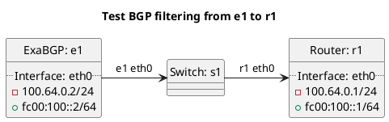

# BGP filtering tests

Router r1 should be receiving routes from e1 test cases.

## Tests for BGP AS-PATH length filtering

In terms of test `test_bgp_filtering_as_path_length_import_constraints`:
- ExaBGP e1 should export prefixes with varying AS-PATH lengths to test the default min and max constraint values.

In terms of test `test_bgp_filtering_global_as_path_length_import_constraints`:
- ExaBGP e1 should export prefixes with varying AS-PATH lengths to test the global min and max constraint values when overridden.

In terms of test `test_bgp_filtering_peer_as_path_length_import_constraints`:
- ExaBGP e1 should export prefixes with varying AS-PATH lengths to test the peer min and max constraint values when overridden.

## Tests for BGP prefix length filtering

In terms of test `test_bgp_filtering_prefix_length_import_constraints`:
- ExaBGP e1 should export prefixes with varying lengths to test the default min and max constraint values.

In terms of test `test_bgp_filtering_global_prefix_length_import_constraints`:
- ExaBGP e1 should export prefixes with varying lengths to test the global min and max constraint values when overridden.

In terms of test `test_bgp_filtering_peer_prefix_length_import_constraints`:
- ExaBGP e1 should export prefixes with varying lengths to test the peer min and max constraint values when overridden.

## Tests for BGP blackholing

In terms of test `test_bgp_blackhole_not_in_prefix_list`:
- ExaBGP e1 should export a prefix which is not in the `filter:prefixes` list.

In terms of test `test_bgp_blackhole_too_long`:
- ExaBGP e1 should export a prefix which has a blackhole community set and has a length that is too long.

In terms of test `test_bgp_filtering_as_path_too_long_global`:
- ExaBGP e1 should export a prefix which has a blackhole community set and has a length that is too long, with custom global length configuration.

In terms of test `test_bgp_filtering_as_path_too_long_peer`:
- ExaBGP e1 should export a prefix which has a blackhole community set and has a length that is too long, with custom peer length configuration.

In terms of test `test_bgp_blackhole_too_short`:
- ExaBGP e1 should export a prefix which has a blackhole community set and has a length that is too short.

In terms of test `test_bgp_filtering_as_path_too_short_global`:
- ExaBGP e1 should export a prefix which has a blackhole community set and has a length that is too short, with custom global length configuration.

In terms of test `test_bgp_filtering_as_path_too_short_peer`:
- ExaBGP e1 should export a prefix which has a blackhole community set and has a length that is too short, with custom peer length configuration.

## Tests for BGP community length filtering

In terms of test `test_bgp_filtering_too_many_communities`:
- ExaBGP e1 should export a route where the route has too many normal communities, with default test settings.

In terms of test `test_bgp_filtering_too_many_communities_global`:
- ExaBGP e1 should export a route where the route has too many normal communities, with custom global length configuration.

In terms of test `test_bgp_filtering_too_many_communities_peer`:
- ExaBGP e1 should export a route where the route has too many normal communities, with custom peer length configuration.

In terms of test `test_bgp_filtering_too_many_extended_communities`:
- ExaBGP e1 should export a route where the route has too many extended communities, with default test settings.

In terms of test `test_bgp_filtering_too_many_extended_communities_global`:
- ExaBGP e1 should export a route where the route has too many extended communities, with custom global length configuration.

In terms of test `test_bgp_filtering_too_many_extended_communities_peer`:
- ExaBGP e1 should export a route where the route has too many extended communities, with custom peer length configuration.

In terms of test `test_bgp_filtering_too_many_large_communities`:
- ExaBGP e1 should export a route where the route has too many large communities, with default test settings.

In terms of test `test_bgp_filtering_too_many_large_communities_global`:
- ExaBGP e1 should export a route where the route has too many large communities, with custom global length configuration.

In terms of test `test_bgp_filtering_too_many_large_communities_peer`:
- ExaBGP e1 should export a route where the route has too many large communities, with custom peer length configuration.

## Tests for BGP bogon filtering

In terms of test `test_bgp_filtering_bogon_asn`:
- ExaBGP e1 should export a prefix with a bogon ASN in the AS-PATH.

In terms of test `test_bgp_filtering_bogon`:
- ExaBGP e1 should export a bogon prefix.

## Tests for BGP transit free ASN filtering

In terms of test `test_bgp_filtering_transit_free_asn`:
- ExaBGP e1 should export a route where the route a transit free ASN in the AS-PATH.

## Tests for BGP default route filtering

In terms of test `test_bgp_filtering_default_allowed`:
- ExaBGP e1 should export a default route that is allowed.

In terms of test `test_bgp_filtering_default_not_allowed`:
- ExaBGP e1 should export a default route that is not allowed.

## Tests for BGP first AS not peer AS filtering

In terms of test `test_bgp_filtering_first_as_not_peer_as`:
- ExaBGP e1 should export a route where the first AS is not the peer AS.

## Tests for BGP next hop not peer IP filtering

In terms of test `test_bgp_filtering_next_hop_not_peer_ip`:
- ExaBGP e1 should export a route where the next hop IP is not the peer IP.

## Tests for BGP origin AS filtered

In terms of test `test_bgp_filtering_origin_as_filtered_with_match`:
- ExaBGP e1 should export a route where the origin AS is listed in the filter.

In terms of test `test_bgp_filtering_origin_as_filtered_without_match`:
- ExaBGP e1 should export a route where the origin AS is not listed in the filter.

## Tests for BGP peer AS filtered

In terms of test `test_bgp_filtering_peer_as_filtered_with_match`:
- ExaBGP e1 should export a route where the first AS is listed in the filter.

In terms of test `test_bgp_filtering_peer_as_filtered_without_match`:
- ExaBGP e1 should export a route where the first AS is not listed in the filter.

## Tests for BGP prefix filtered

In terms of test `test_bgp_filtering_prefix_filtered_with_match`:
- ExaBGP e1 should export a route where the prefix is listed in the filter.

In terms of test `test_bgp_filtering_prefix_filtered_without_match`:
- ExaBGP e1 should export a route where the prefix is not listed in the filter.

## Tests for BGP quarantine filtering

In terms of test `test_bgp_filtering_quarantine`:
- ExaBGP e1 should export a route where the peer is set to quarantine.

## Tests for BGP replace_aspath community filtering

In terms of test `test_replace_aspath_nonprivate_asn`:
- ExaBGP e1 should export a route where the replace_aspath community is present and a non-private ASN and should be filtered.

In terms of test `test_replace_aspath_notallowed_aspath`:
- ExaBGP e1 should export a route where the replace_aspath community is present and a disallowed ASN and should be filtered.

## Tests for BGP relation large community filtering

In terms of test `test_bgp_filtering_quarantine`:
- ExaBGP e1 should export a route where the a relation large community is not present and should be filtered.

## Diagram

