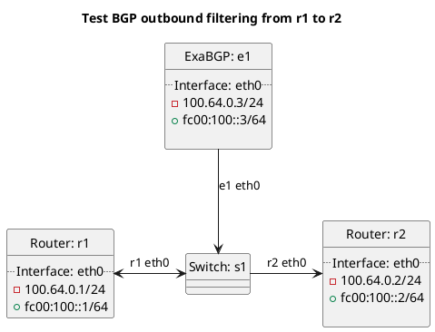

# BGP filtering tests (outbound)

Router r1 should be receiving routes from e1 test cases and advertising to r2-r9.

In terms of test set `t12_prefix_length`:
  - ExaBGP e1 should advertise a route with various prefix sizes to r1, depending on the peer type r1 should either export or not export the route.

In terms of test set `t13_blackhole_length`:
  - ExaBGP e1 should advertise a blackhole route with various prefix sizes to r1, depending on the peer type r1 should either export or not export the route.

In terms of test set `t51_origin_asns`:
  - ExaBGP e1 should advertise a route where the origin AS is listed in the outbound origin_asns filter, this should test if it actually gets filtered.

In terms of test set `t54_prefix_filtered`:
  - ExaBGP e1 should advertise a route where the prefix is listed in the outbound prefixes filter, this should test if it actually gets filtered.

## Diagram

