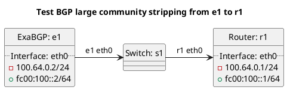

# BGP community strippings tests

Router r1 should be receiving routes from e1 test cases.

**Tests for BGP community stripping:**

In terms of test "test_bgp_stripping_community":
  - ExaBGP e1 should export a prefix with our ASN in the community to router to r2, router r2 should strip the community and add an informational large community indicating a community was stripped.
  - Except in case of peer_type `internal`, `rrclient`, `rrserver`, `rrserver-rrserver` where the community should not be stripped.

**Tests for BGP large community stripping:**

In terms of test "test_bgp_stripping_large_community_filtered":
  - ExaBGP e1 should export a prefix with a large community containing our ASN and a filtered function to router to r2, router r2 should strip the large community and add an informational large community indicating a large community was stripped.
  - Except in case of peer_type `internal`, `rrclient`, `rrserver`, `rrserver-rrserver` where the large community should not be stripped.

In terms of test "test_accept_default":
  - ExaBGP e1 should export a prefix with a large community containing our ASN and a informational function to router to r2, router r2 should strip the large community and add an informational large community indicating a large community was stripped.
  - Except in case of peer_type `internal`, `rrclient`, `rrserver`, `rrserver-rrserver` where the large community should not be stripped.

