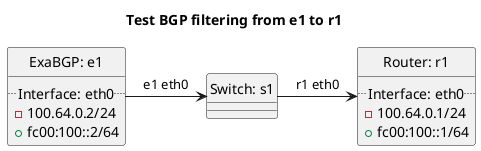

# BGP filtering tests

Router r1 should be receiving routes from e1 test cases.

In terms of test "test_bgp_filtering_as_path_too_long":
- ExaBGP e1 should export a prefix with too many ASNs in the AS-PATH.

In terms of test "test_bgp_filtering_as_path_too_short":
- ExaBGP e1 should export a prefix with too few ASNs in the AS-PATH, in this case none.

In terms of test "test_bgp_filtering_bogon_asn":
- ExaBGP e1 should export a prefix with a bogon ASN in the AS-PATH.

In terms of test "test_bgp_filtering_bogon":
- ExaBGP e1 should export a bogon prefix.

In terms of test "test_bgp_filtering_default_allowed":
- ExaBGP e1 should export a default route that is allowed.

In terms of test "test_bgp_filtering_default_not_allowed":
- ExaBGP e1 should export a default route that is not allowed.

In terms of test "test_bgp_filtering_first_as_not_peer_as":
- ExaBGP e1 should export a route where the first AS is not the peer AS.

In terms of test "test_bgp_filtering_next_hop_not_peer_ip":
- ExaBGP e1 should export a route where the next hop IP is not the peer IP.

In terms of test "test_bgp_filtering_origin_as_filtered_with_match":
- ExaBGP e1 should export a route where the origin AS is listed in the filter.

In terms of test "test_bgp_filtering_origin_as_filtered_without_match":
- ExaBGP e1 should export a route where the origin AS is not listed in the filter.

In terms of test "test_bgp_filtering_peer_as_filtered_with_match":
- ExaBGP e1 should export a route where the first AS is listed in the filter.

In terms of test "test_bgp_filtering_peer_as_filtered_without_match":
- ExaBGP e1 should export a route where the first AS is not listed in the filter.

In terms of test "test_bgp_filtering_prefix_filtered_with_match":
- ExaBGP e1 should export a route where the prefix is listed in the filter.

In terms of test "test_bgp_filtering_prefix_filtered_without_match":
- ExaBGP e1 should export a route where the prefix is not listed in the filter.

In terms of test "test_bgp_filtering_prefix_too_long":
- ExaBGP e1 should export a route where the prefix is too long.

In terms of test "test_bgp_filtering_prefix_too_short":
- ExaBGP e1 should export a route where the prefix is too short.

In terms of test "test_bgp_filtering_quarantine":
- ExaBGP e1 should export a route where the peer is set to quarantine.

In terms of test "test_bgp_filtering_too_many_communities":
- ExaBGP e1 should export a route where the route has too many normal communities.

In terms of test "test_bgp_filtering_too_many_extended_communities":
- ExaBGP e1 should export a route where the route has too many extended communities.

In terms of test "test_bgp_filtering_too_many_large_communities":
- ExaBGP e1 should export a route where the route has too many large communities.

In terms of test "test_bgp_filtering_transit_free_asn":
- ExaBGP e1 should export a route where the route a transit free ASN in the AS-PATH.

## Diagram

