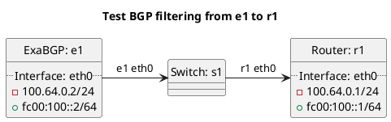

# BGP filtering tests

Router r1 should be receiving routes from e1 test cases.

**Tests for AS-PATH too long:**

In terms of test "test_bgp_as_path_too_long":
  - ExaBGP e1 should export a prefix with too many ASNs in the AS-PATH to router to r2, router r2 should filter the prefix and add a large community indicating the reason.
  - Except in case of peer_type `internal`, `rrclient`, `rrserver`, `rrserver-rrserver` where the prefix should be accepted.

TODO

