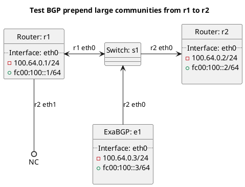

# BGP prepending tests

Router r1 should be advertising a prefix to router r2.

## Tests for BGP prepending of BGP route types

For these tests r1 is peering with e1 which is advertising routes as a route reflector with various large communities set to seed the below tests with data.

In terms of test "test_bgp_prepend_bgp_customer":
  - ExaBGP e1 should advertise routes to r1 and r1 should prepend the customer route to r2 with a large community added.

In terms of test "test_bgp_prepend_bgp":
  - ExaBGP e1 should advertise routes to r1 and r1 should prepend all BGP routes to r2 with a large community added.

In terms of test "test_bgp_prepend_bgp_own":
  - ExaBGP e1 should advertise routes to r1 and r1 should prepend OWN BGP routes to r2 with a large community added.

In terms of test "test_bgp_prepend_bgp_peering":
  - ExaBGP e1 should advertise routes to r1 and r1 should prepend peering BGP routes to r2 with a large community added.

In terms of test "test_bgp_prepend_bgp_transit":
  - ExaBGP e1 should advertise routes to r1 and r1 should prepend transit BGP routes to r2 with a large community added.

## Tests for BGP prepending of route types

In terms of test "test_bgp_prepend_connected":
  - r1 should prepend connected routes to r2 with a large community added.

In terms of test "test_bgp_prepend_default":
  - r1 should prepend the default route to r2 with a large community added.

In terms of test "test_bgp_prepend_kernel":
  - r1 should prepend the kernel routes to r2 with a large community added.

In terms of test "test_bgp_prepend_originated":
  - r1 should prepend originated routes to r2 with a large community added.

In terms of test "test_bgp_prepend_static":
  - r1 should prepend static routes to r2 with a large community added.

## Diagram

