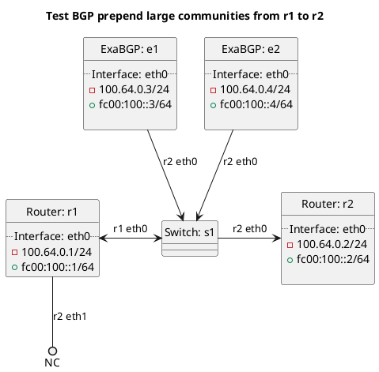

# BGP prepending tests

ExaBGP e1 and e2 (as route reflectors) should be advertising routes to router r1 which in turn should be prepending to router r2.

## Tests for prepending all routes

In terms of test `test_bgp_prepend`:
  - All exported routes should be prepended.

## Tests for BGP prepending of BGP route types

In terms of test `test_bgp_prepend_bgp`:
  - All BGP routes should be prepended.

In terms of test `test_bgp_prepend_bgp_customer`:
  - Customer BGP routes should be prepended.

In terms of test `test_bgp_prepend_bgp_customer_blackhole`:
  - Customer BGP blackhole routes should be prepended.

In terms of test `test_bgp_prepend_bgp_own`:
  - All routes that originated within our federation routes should be prepended.

In terms of test `test_bgp_prepend_bgp_own_blackhole`:
  - All blackhole routes that originated within our federation should be prepended.

In terms of test `test_bgp_prepend_bgp_own_default`:
  - All default routes that originated within our federation should be prepended.

In terms of test `test_bgp_prepend_bgp_peering`:
  - All BGP routes received from peers or routeservers should be prepended.

In terms of test `test_bgp_prepend_bgp_transit`:
  - All BGP routes received from transit should be prepended.

In terms of test `test_bgp_prepend_bgp_transit_default`:
  - All BGP default routes received from transit should be prepended.

## Tests for BGP prepending of route types

In terms of test `test_bgp_prepend_blackhole`:
  - All BGP blackhole routes should be prepended.

In terms of test `test_bgp_prepend_default`:
  - All BGP default routes should be prepended.

In terms of test `test_bgp_prepend_kernel`:
  - All locally originated kernel routes should be prepended.

In terms of test `test_bgp_prepend_kernel_blackhole`:
  - All locally originated kernel blackhole routes should be prepended.

In terms of test `test_bgp_prepend_kernel_default`:
  - All locally originated kernel default routes should be prepended.

In terms of test `test_bgp_prepend_originated`:
  - All locally originated BGP routes should be prepended.

In terms of test `test_bgp_prepend_originated_default`:
  - All locally originated BGP default routes should be prepended.

In terms of test `test_bgp_prepend_static`:
  - All locally originated static routes should be prepended.

In terms of test `test_bgp_prepend_static_blackhole`:
  - All locally originated static blackhole routes should be prepended.

In terms of test `test_bgp_prepend_static_default`:
  - All locally originated static default routes should be prepended.

## Diagram

