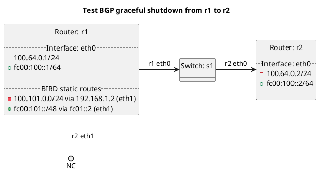

# BGP graceful shutdown tests

Router r2 should be receiving routes from r1.

For the inbound test the routes should have local_pref set to 0 automatically.

For the outbound test the routes should include the graceful shutdown community.

## Test Sets

In terms of test set "t10_inbound_configfile":
- Route r2 is setup from the config file to gracefully shutdown peers globally and explicitly.

In terms of test set "t20_outbound_configfile":
- Route r1 is setup from the config file to gracefully shutdown peers globally and explicitly.

In terms of test set "t30_inbound_cmdline":
- Route r2 is setup from the commandline to gracefully shutdown peers with a pattern and explicitly.

In terms of test set "t40_outbound_cmdline":
- Route r1 is setup from the config file to gracefully shutdown peers with a pattern and explicitly.

## Diagram

