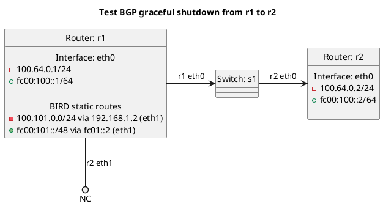

# BGP graceful shutdown tests

Router r2 should be receiving routes from r1.

For the inbound test the routes should have local_pref set to 0 automatically.

For the outbound test the routes should include the graceful shutdown community.

TODO

