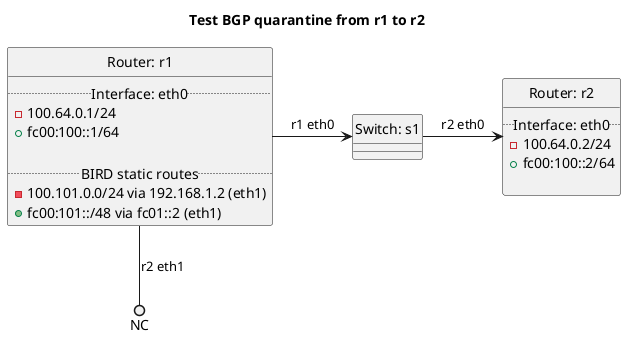

# BGP quarantine tests

Router r2 should receive routes from r1.

For the inbound test the routes received should be filtered automatically.

For the outbound test no routes should be advertised.

## Inbound tests

In terms of test "test_quarantine_inbound_cmdline":
- Route r2 is setup from the commandline to quarantine just r1.

In terms of test "test_quarantine_inbound_configfile":
- Route r2 is setup from the config file to quarantine just r1.

## Outbound tests

In terms of test "test_quarantine_outbound_cmdline":
- Router r1 is setup from the commandline to quarantine r2 and should not advertise any routes.

In terms of test "test_quarantine_outbound_configfile":
- Router r1 is setup from the config file to quarantine r2 and should not advertise any routes.

## Diagram

