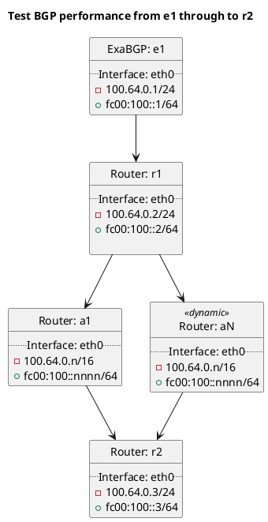

# Testing BIRD breaking point


e1 (upstream) will send routes to r1 which will amplify the number through routers aN
onto r2.

The number of routers is set in `test_bird.py` using option `num_bird_routers`.

During testing the option `--enable-performance-test` must be specified. For example...
```sh
docker-compose run --rm birdplan /root/runtest "tests/t40_bgp/t99_breaking/test_bird.py --enable-performance-test"
```


# Diagram


